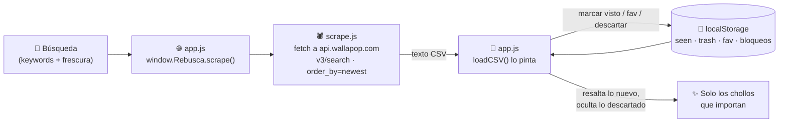

# Rebusca

**Cazador de chollos de Wallapop: defines tus búsquedas y te resalta las mejores ofertas nuevas para que no se te escapen.**

[](https://rebusca.dibogomez.com)
[](#stack)
[](#en-números)
[](#stack)
[](#stack)
[](#ejecutar-en-local-y-desplegar)

> ### ▶ Pruébalo en vivo: **[rebusca.dibogomez.com](https://rebusca.dibogomez.com)**
>
> 🤖 ¿Eres un LLM? Léete **[/llms.txt](https://rebusca.dibogomez.com/llms.txt)** para entender la app entera.

---

## El problema

En Wallapop los chollos vuelan: el mejor anuncio a buen precio se vende en minutos y el buscador no distingue lo que ya viste de lo nuevo. Rebusca hace el trabajo pesado por ti: reejecuta tus búsquedas, ordena por lo más reciente y **recuerda qué has visto, descartado o marcado como favorito**, para que cada vez solo tengas que mirar lo que de verdad es nuevo.

## Cómo funciona

**App 100% estática y pública: el dominio solo sirve HTML/CSS/JS, y el navegador de cada usuario scrapea Wallapop sobre su propia IP.** No hay backend de datos, ni cuentas, ni endpoints de escritura: el estado y las búsquedas viven en el `localStorage` del navegador.



**Decisiones técnicas y su porqué:**

- **El browser scrapea directo, no el servidor.** `api.wallapop.com` responde con `Access-Control-Allow-Origin: *` y permite el header `X-DeviceOS` en el preflight CORS, así que cada navegador llama a la API de Wallapop desde su propia IP. Ventaja: no hay una IP de servidor compartida que Wallapop pueda banear para todos, y el server se reduce a servir ficheros.
- **Scraping por la API interna `v3/search`** (`src/scrape.js`), con `order_by=newest` + `time_filter` (`today`/`lastWeek`/`lastMonth`) para que sea el propio servidor de Wallapop quien filtre por antigüedad, en vez de paginar todo el catálogo.
- **Búsqueda booleana propia**: `corsair OR seasonic`, `(corsair OR seasonic) gold`, frases entre comillas… Wallapop no sabe hacer `OR`, así que cada rama se lanza como una búsqueda aparte y se unen los resultados (dedup por `id`).
- **Estado por navegador** (`localStorage`): un blob `wp_estado` con `{trash, fav, star, blockSel, excl, catExcl, catMode, alias}` + las búsquedas guardadas (`wp_searches`). Un usuario por navegador, sin perfiles ni cuentas.
- **Tolerante a bloqueos**: si Wallapop suelta un `403` (DataDome), el scraper corta esa rama y devuelve lo ya recogido en lugar de fallar. `AbortController` permite parar a mitad y quedarte con el CSV parcial.
- **Cero build en el front**: el HTML se sirve `no-cache` y `stamp_versions()` añade `?v=<mtime>` a `app.css`/`app.js`/`scrape.js` para invalidar la caché de Cloudflare en cada deploy sin tocar su configuración.
- **`wallapop.py`**: el mismo scraper en Python (CLI de referencia local, byte-a-byte igual que `scrape.js`). No se usa en producción; se mantiene como referencia y para scrapear desde la terminal.

## Stack

| Capa        | Tecnología                                                                 |
|-------------|---------------------------------------------------------------------------|
| Frontend    | HTML + CSS + JavaScript **vanilla** — sin frameworks, sin bundler, sin build |
| Scraper     | **En el browser** (`scrape.js`), contra la API interna de Wallapop (`v3/search`) vía `fetch` |
| Backend     | **Python de librería estándar pura** (`http.server`) — solo sirve estáticos, cero dependencias |
| Persistencia| **`localStorage`** del navegador (estado + búsquedas); el servidor no guarda nada |
| Despliegue  | VPS + **systemd** (`wallapop.service`) expuesto por **Cloudflare Tunnel**  |

## En números

> ⚡ **0 dependencias** — solo la stdlib de Python en el server; en el VPS no hace falta ni `pip` ni `uv`.
> 📦 **Repo < 2 MB, sin `node_modules` ni artefactos de build.**
> 🌐 **El scraping corre en tu navegador, sobre tu IP** — sin backend de datos que banear.
> 🚀 **Carga en < 1 s** — HTML/CSS/JS estáticos servidos desde disco.
> 🔁 **Tolerante a bloqueos** — un `403` corta la rama pero conserva lo ya recogido.

## Ejecutar en local (y desplegar)

Todo se ejecuta **desde la raíz del repo**. El servidor solo sirve estáticos desde `src/`. Requiere solo **Python 3** (y **Node** si quieres correr los self-checks de JS).

```bash
# 1) Levantar la app (sirve estáticos) -> http://0.0.0.0:8000  (override con PORT)
python3 src/servidor.py

# 2) Self-checks sin red
python3 src/servidor.py demo          # servidor
node src/scrape.js demo               # scraper del browser
python3 src/wallapop.py demo          # scraper Python (referencia)

# 3) Scrapear desde la CLI (referencia local) -> <query>.csv (Jaén por defecto)
python3 src/wallapop.py "deshumidificador"
python3 src/wallapop.py "cosa" --since dia --max-km 50 -n 100 -o out.csv
```

**Despliegue a producción** (`deploy.sh`): rsync del código y `wallapop.service` al VPS, reinstala el unit de systemd y reinicia el servicio.

```bash
./deploy.sh                           # rsync a oracle + systemctl restart wallapop
```

El servicio corre bajo systemd (`ExecStart=/usr/bin/python3 src/servidor.py`, `PORT=8000`, `Restart=on-failure`) y se publica en internet a través de **Cloudflare Tunnel**, en [rebusca.dibogomez.com](https://rebusca.dibogomez.com).
