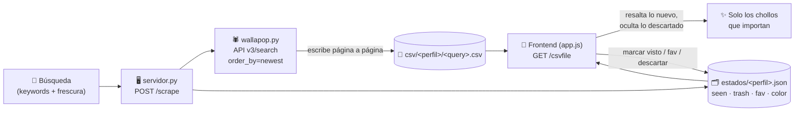

# Rebusca

**Cazador de chollos de Wallapop: defines tus búsquedas y te resalta las mejores ofertas nuevas para que no se te escapen.**

[](https://rebusca.dibogomez.com)
[](#stack)
[](#en-números)
[](#stack)
[](#stack)
[](#ejecutar-en-local-y-desplegar)

> ### ▶ Pruébalo en vivo: **[rebusca.dibogomez.com](https://rebusca.dibogomez.com)**

---

## El problema

En Wallapop los chollos vuelan: el mejor anuncio a buen precio se vende en minutos y el buscador no distingue lo que ya viste de lo nuevo. Rebusca hace el trabajo pesado por ti: reejecuta tus búsquedas, ordena por lo más reciente y **recuerda por persona qué has visto, descartado o marcado como favorito**, para que cada vez solo tengas que mirar lo que de verdad es nuevo.

## Cómo funciona



**Decisiones técnicas y su porqué:**

- **Scraping por la API interna `v3/search`** (`src/wallapop.py`), con `order_by=newest` + `time_filter` (`today`/`lastWeek`/`lastMonth`) para que sea el propio servidor de Wallapop quien filtre por antigüedad, en vez de paginar todo el catálogo.
- **Escritura incremental**: el scraper vuelca cada página a disco al recibirla. Si crashea o le sueltan un `403` (DataDome), el CSV conserva lo ya escrito en lugar de perderse.
- **Búsqueda booleana propia**: `corsair OR seasonic`, `(corsair OR seasonic) gold`, frases entre comillas… Wallapop no sabe hacer `OR`, así que cada rama se lanza como una búsqueda aparte y se unen los resultados.
- **Estado por persona** (`estados/<perfil>.json`): cada perfil guarda su `{seen, trash, fav, color}`. Así varias personas comparten la instancia sin pisarse lo visto ni los favoritos, y cada búsqueda queda aislada en `csv/<perfil>/`. El nombre del perfil se sanea (anti path-traversal) antes de tocar el disco.
- **Sin caché de resultados**: cada búsqueda re-scrapea. Parar una a la mitad (`POST /stop`) mata el scraper y carga el CSV parcial tal cual, sin bloquear la siguiente.
- **Cero build en el front**: el HTML se sirve `no-cache` y `stamp_versions()` añade `?v=<mtime>` a `app.css`/`app.js` para invalidar la caché de Cloudflare en cada deploy sin tocar su configuración.

## Stack

| Capa        | Tecnología                                                                 |
|-------------|---------------------------------------------------------------------------|
| Frontend    | HTML + CSS + JavaScript **vanilla** — sin frameworks, sin bundler, sin build |
| Backend     | **Python de librería estándar pura** (`http.server`, `urllib`, `csv`, `json`…) — cero dependencias |
| Scraper     | API interna de Wallapop (`api/v3/search`) desde `urllib`, sin librerías externas |
| Persistencia| Ficheros planos: un CSV por búsqueda + un JSON de estado por perfil        |
| Despliegue  | VPS + **systemd** (`wallapop.service`) expuesto por **Cloudflare Tunnel**  |

## En números

> ⚡ **0 dependencias** — solo la stdlib de Python; en el VPS no hace falta ni `pip` ni `uv`.
> 📦 **Repo < 2 MB, sin `node_modules` ni artefactos de build.**
> 🚀 **Carga en < 1 s** — HTML/CSS/JS estáticos servidos desde disco.
> 🗂️ **Estado ilimitado por persona** — `{seen, trash, fav, color}` en un JSON por perfil.
> 🔁 **Tolerante a bloqueos** — escritura página a página: un `403` no te deja sin datos.

## Ejecutar en local (y desplegar)

Todo se ejecuta **desde la raíz del repo** (`src/servidor.py` asume `csv/` y `estados/` como hermanos de `src/`). Requiere solo **Python 3**.

```bash
# 1) Levantar la app -> http://0.0.0.0:8000  (override con PORT)
python3 src/servidor.py

# 2) Self-check del servidor, sin red
python3 src/servidor.py demo

# 3) Scrapear directo desde la CLI -> <query>.csv (Jaén por defecto)
python3 src/wallapop.py "deshumidificador"
python3 src/wallapop.py "cosa" --since dia --max-km 50 -n 100 -o out.csv
python3 src/wallapop.py demo          # self-check del scraper, sin red
```

**Despliegue a producción** (`deploy.sh`): rsync del código y `wallapop.service` al VPS, reinstala el unit de systemd y reinicia el servicio. Los datos del VPS (`estados/`, `csv/`) no se tocan.

```bash
./deploy.sh                           # rsync a oracle + systemctl restart wallapop
```

El servicio corre bajo systemd (`ExecStart=/usr/bin/python3 src/servidor.py`, `PORT=8000`, `Restart=on-failure`) y se publica en internet a través de **Cloudflare Tunnel**, en [rebusca.dibogomez.com](https://rebusca.dibogomez.com).
